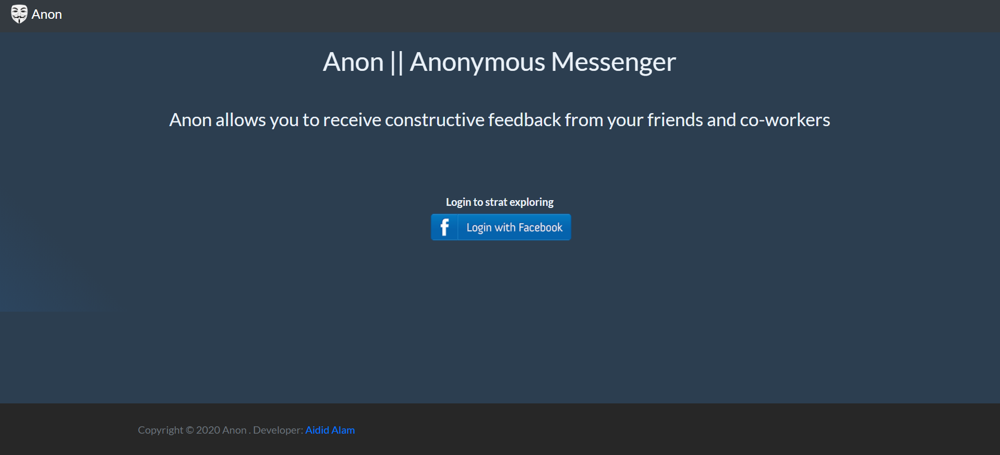
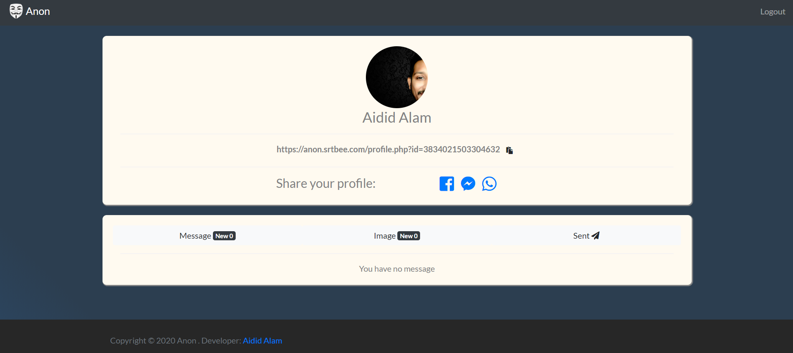
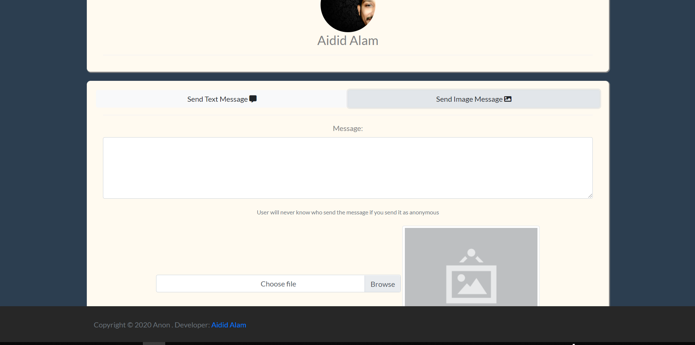

# Anonymous-messenger
Treading Anonymous messenger sarahah concept with image message

# Features:
- Facebook Login
- Unique profile link for every user
- User can get both text message and Image message
- user can share the messages on facebook
- Og image creator for facebook
- Bootstrap Landing Page

# Installation:
Project is in PHP.There is a file under config called Strings.php. You have to update:

-Database Cardinals
-Fb App ID and Secret Id
-Site url
-Site title,description,keywords etc
